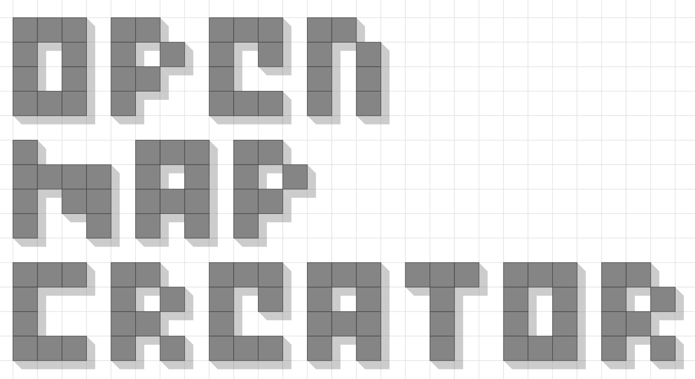
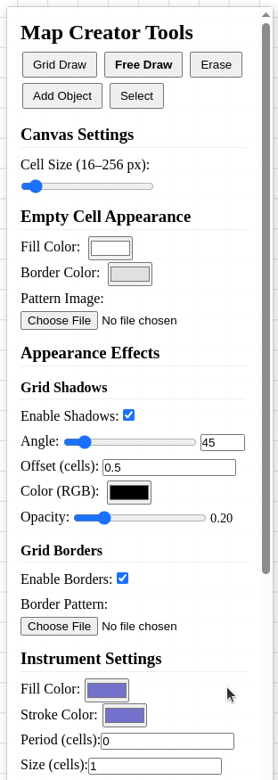

# 🗺️ Open Map Creator

[](https://opensource.org/licenses/MIT) [](CONTRIBUTING.md) [](code_of_conduct.md)

**A free, open-source, browser-based application for creating easily printable beautiful TTRPG maps. Runs entirely locally in your browser!**



## Try it [here](https://rokoel.github.io/Open-Map-Creator/)!

---

## 🔎 What we focus on

*   **Open Source & Ease of Contribution:** Licensed under MIT, free to use, modify, and distribute. We welcome community contributions! Code is specifically written in JavaScript, HTML and CSS without any unnecessary libraries (currently, only [jsPDF](https://github.com/parallax/jsPDF) is used).
*   **Browser-Based & Local:** Runs entirely in your modern web browser. No installation needed, and your maps are saved locally using your browser's storage unless you explicitly export them.
*   **Community Driven:** We aim to build a tool shaped by the needs of the TTRPG community.
*   **Special features:** Our project already has some neat features that other similar open-source projects don't have (real-world-size-focused PDF export, shadows and shadow settings). We would like to implement more cool and unique features in the future! 

## ✨ Features & Tools

*   **Infinite Canvas:** Pan and zoom smoothly across your map.
*   **Customizable Grid:** Style empty cells (color, pattern).
*   **Layer System:** Organize your map elements with multiple layers (add, remove, select).
*   **Drawing Tools:**
    *   **Grid Draw:** Fill grid cells with solid colors or image patterns (upload your own!).
    *   **Free Draw:** Draw shapes or place patterns freely. Features a unique **Period** setting for spaced placement (which maybe useful for placing hills, mountains and trees). Supports color fills and image patterns.
    *   **Erase:** Remove grid elements or free-drawn objects.
*   **Object Placement:** Upload custom images (PNGs, JPGs, SVGs) as objects, then place, move, rotate, and resize them on the map.
*   **Selection Tool:** Select individual cells, free-draw elements, or custom objects. Select multiple items by dragging. Move, rotate, resize, delete, copy, and paste selections.
*   **Appearance Effects:**
    *   **Grid Shadows:** Add depth with configurable, **per-layer** shadows cast by filled cells (angle, offset, color, opacity are customizable).
    *   **Grid Borders:** Apply classic pattern-based borders around the edges of filled areas (upload your own patterns).
*   **Data Management:**
    *   **Auto-Save:** Work is automatically saved to your browser's local storage.
    *   **Undo/Redo:** Don't worry about mistakes!
    *   **JSON Export/Import:** Save your entire map (including settings, layers, objects, and image data URIs) to a shareable JSON file and load maps from these files.
    *   **PDF Export:** Export for printing with tiling, DPI settings, and physical cell size control. You need your cells to be 2.5 by 2.5 centimeters? No problem.

## 📸 Screenshots / Demo


 


## 🚀 Getting Started

Since Open Map Creator runs entirely in the browser, getting started is simple:

1.  **Clone the Repository:**
    ```bash
    git clone https://github.com/Rokoel/Open-Map-Creator.git
    cd Open-Map-Creator
    ```
2.  **Open in Browser:**
    Simply open the `index.html` file directly in a modern web browser like Chrome, Firefox, or Edge.

That's it! No build steps or servers required for basic use.

## 🖱️ Usage

*   The main area is the **Canvas** where you create your map.
    *   **Pan:** Hold the Middle Mouse Button and drag.
    *   **Zoom:** Use the Mouse Wheel.
*   The floating panel on the right is the **HUD**.
    *   Use the **Toolbar** buttons at the top to select your active tool (Grid Draw, Free Draw, Select, etc.).
    *   The **Instrument Settings** section will update with options relevant to the selected tool.
    *   Configure overall canvas, empty cell, shadow, and border settings in their respective sections.
    *   Manage layers using the **Layers** panel.
    *   Use the **Data** section to Export, Import, or Clear your map.

## 🤝 Contributing

Contributions are what make the open-source community such an amazing place to learn, inspire, and create. We warmly welcome contributions to Open Map Creator!

**Types of Contributions:**

*   Reporting Bugs
*   Suggesting Enhancements or New Features
*   Writing or Improving Documentation
*   Submitting Fixes or New Code
*   Testing

**How to Contribute:**

1.  **Issues:** Please open an issue first to discuss any significant changes or new features you'd like to implement. For bugs, provide clear steps to reproduce.
2.  **Fork & Branch:** Fork the repository and create a new branch for your contribution (`git checkout -b feature/your-feature-name` or `bugfix/issue-number`).
3.  **Code:** Make your changes. Please try to follow the existing code style (we use Prettier for formatting) and add comments where necessary.
4.  **Pull Request:** Submit a pull request back to the main repository's `main` (or `develop`) branch, clearly describing the changes you've made.

Please read our `CONTRIBUTING.MD` file for more detailed guidelines.

## 📜 License

This project is licensed under the **MIT License**. See the `LICENSE` file for details.

This means you are free to use, copy, modify, merge, publish, distribute, sublicense, and/or sell copies of the software, provided the original copyright notice and license text are included. It's a very permissive license designed to encourage widespread use and contribution.

## 💡 Future Ideas / Roadmap

This project is just beginning! Here's the **TODO** of the project:

*   [ ] More built-in assets and brushes (symbols, textures).
*   [ ] Advanced object manipulation (grouping, alignment tools, snapping).
*   [ ] More export options (e.g., VTT-compatible formats like Universal VTT).
*   [ ] Performance optimizations for very large maps.
*   [ ] UI/UX improvements and polish.
*   [ ] Layer visibility toggles and locking.
*   [ ] Path connection for Free Draw.
*   [ ] Better "borders" functionality.
*   [ ] User-defined color palettes.
*   [ ] Measurement tools.

Have other ideas? Open an issue! Know how to implement a feature or want to fix a bug/typo? Feel free to contribute!

---

Thank you for checking out Open Map Creator! We hope you find it useful for your TTRPG adventures.
